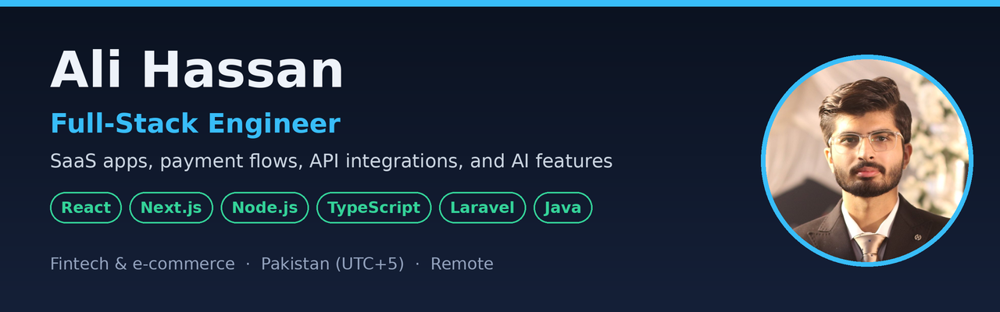

# Hi, I'm Ali Hassan

I build SaaS products, payment flows, and integrations that take manual work out of a team's day, and I fix the slow or messy codebases that hold teams back. React, Next.js, Node.js, and TypeScript are my main stack, with Laravel, PHP, and Java when the project needs them.

I'm a software engineer at **i2c Inc.**, a global payments company, and I freelance with international clients on Upwork. Before i2c, I worked at **PureLogics**.

**14 Upwork jobs · 91% Job Success · 9 five-star reviews · one UK client hired me three times**

**Available 30+ hours a week**, weekday evenings and weekends Pakistan time, which overlaps the US working day. Hourly or fixed price, and long-term contracts are welcome.

[Portfolio and case studies](https://ali-hassan-dev.netlify.app/upwork) · [Work with me on Upwork](https://www.upwork.com/freelancers/~0110268fa5a62812e0)

## Selected work

### Kodati: multi-tenant gift card fulfillment

Middleware that connects **Salla and Zid** stores to the **EZ PIN and LikeCard** gift card APIs. I owned the backend, integrations, and app logic in a three-person team: webhook-driven fulfillment, product-to-SKU mapping, margin checks before any balance is spent, automatic provider failover, and tenant-level data isolation.

**Built with:** Next.js, TypeScript, MySQL. [Read the case study](https://ali-hassan-dev.netlify.app/upwork#kodati)

### Tawthiq: shared customer reputation for online stores

When one Salla or Zid store rejects a customer, the next store that customer orders from sees an anonymous count before it ships. No store sees who decided or any other store's data. I was the sole developer, working from a designer's Figma files.

**Built with:** React, Node.js, Express, MySQL. [Read the case study](https://ali-hassan-dev.netlify.app/upwork#tawthiq)

### Veriff KYC integration: backend automation

A Node.js and TypeScript service that verifies signed Veriff webhooks with a constant-time HMAC check, fetches each session from seven Veriff endpoints in parallel, and files every JSON record and image into SharePoint, sorted by outcome.

[View the source code](https://github.com/ali-hassan-dev/veriff-kyc-server) · [Read the case study](https://ali-hassan-dev.netlify.app/upwork#veriff)

### Claude content engine for a WordPress SEO plugin

Built the content generation for a client's live [WordPress.org plugin](https://wordpress.org/plugins/improveseo/): single or bulk blog posts from target keywords through the Claude API, scheduled to publish automatically.

### i2c Inc.: Java systems and modernization

- Built a multithreaded batch pipeline that processes **2.2M+ financial records**, with fetcher, processor, and persister threads linked by queues and batched writes.
- Modernized modules of a legacy customer-service app from **Struts/JSP to React**, on **Spring Boot and Hibernate** services.
- Built a bidirectional **Kafka** integration that passes verification flags and agent and queue data between IVR, telephony, and AI systems.

### PureLogics: a MERN learning platform and React performance

- Built a **MERN learning platform** with monthly and yearly **PayPal subscriptions** and automatic course enrollment after payment.
- Cut a React bundle from **1.89 MB to 800 KB** with code splitting, dependency cleanup, and asset optimization, bringing CI build time from **30 minutes to 5**.

These examples describe my own contributions. Employer and client source code is private; my portfolio has more detail and screenshots.

## How I can help

- **SaaS development:** dashboards, admin panels, role-based access, and subscription billing.
- **API integrations:** payments, e-commerce platforms, identity verification, webhooks, and background automation.
- **AI features:** Claude and OpenAI APIs, or local models with Ollama, built into products people already use.
- **Maintenance and modernization:** bug fixes, new features, and refactoring in existing JavaScript, PHP, and Java apps.
- **Performance:** frontend bundles, build times, and slow database queries.

## Technical focus

| Area | Technologies |
| --- | --- |
| Frontend | React, Next.js, TypeScript, Tailwind CSS, Vue.js, Svelte |
| Backend | Node.js, Express.js, Laravel, PHP, Java, Spring Boot |
| Databases | MySQL, PostgreSQL, MongoDB, Microsoft SQL Server |
| Integrations and messaging | REST APIs, OAuth 2.0, webhooks, Stripe, PayPal, Kafka |
| AI | Claude API, OpenAI API, Ollama |
| Testing and delivery | JUnit, TestNG, Selenium, Git, Bitbucket |

## Working together

I clarify the scope and acceptance criteria, break work into reviewable milestones, and flag progress and blockers early. I write maintainable code, test the workflows that matter, and document setup and key decisions.

**Bachelor of Software Engineering, NUST** · Pakistan (UTC+5) · Remote

**Have a feature, integration, or bottleneck to work on?** [Send me your project details on Upwork](https://www.upwork.com/freelancers/~0110268fa5a62812e0), including your priorities and preferred timeline.
